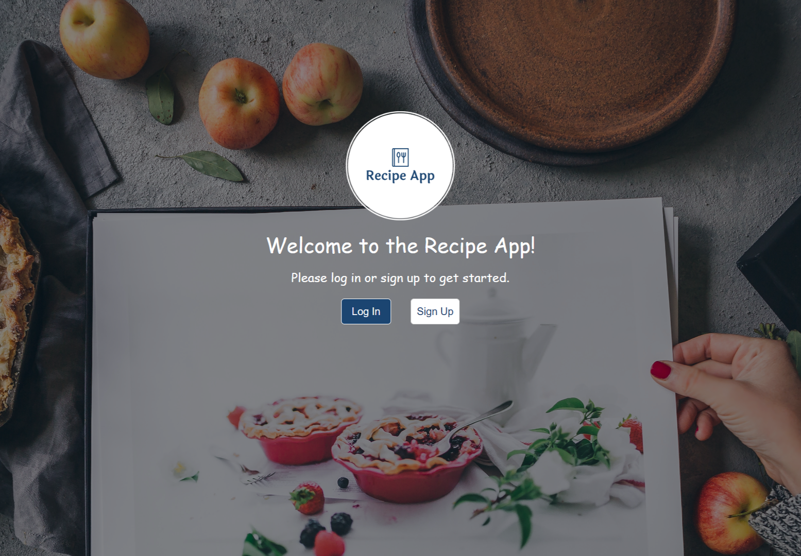

<!-- TABLE OF CONTENTS -->

# 📗 Table of Contents

- [📖 About the Project](#about-project)
  - [🛠 Built With](#built-with)
    - [Tech Stack](#tech-stack)
    - [Key Features](#key-features)
    - [🚀 Live Demo](#live-demo)
- [💻 Getting Started](#getting-started)
  - [Setup](#setup)
  - [Prerequisites](#prerequisites)
  - [Install](#install)
  - [Usage](#usage)
- [👥 Authors](#authors)
- [🔭 Future Features](#future-features)
- [🤝 Contributing](#contributing)
- [⭐️ Show your support](#support)
- [📝 License](#license)

# 📖 [Recipe App] <a name="about-project"></a>

<div align="center">
  
  <br/>

  <h3><b>Recipe App</b></h3>

</div>

> The Recipe app keeps track of all your foods, recipes, and ingredients. It allows you to save ingredients, keep track of what you have, create recipes, and generate a shopping list based on what you have and what you are missing from a recipe. Also, since sharing recipes is an important part of cooking, the app allows you to make them public so anyone can access them.

## Built With <a name="built-with"></a>

- Ruby
- Rails
- Postgresql

### Tech Stack <a name="tech-stack"></a>

<details>
<summary>Server</summary>
  <ul>
    <li><a href="https://www.ruby-lang.org/en/">Ruby</a></li>
  </ul>
</details>

<!-- Features -->

### Key Features <a name="key-features"></a>

- **[A login page]**
- **[A registration page]**
- **[A general shopping list view]**

<p align="right">(<a href="#readme-top">back to top</a>)</p>

<!-- LIVE DEMO -->

## 🚀 Live Demo <a name="live-demo"></a>

- [Live Demo Link](https://recipe-app121-b8888e20687b.herokuapp.com/)

<p align="right">(<a href="#readme-top">back to top</a>)</p>

## 💻 Getting Started <a name="getting-started"></a>

To run this project, take a copy of the code and follow the instruction below.

### Prerequisites

You need Ruby v3+, Rails v7+ and Postgresql installed on your machine.

### Setup

`Clone the project`

Install gems with:

```
bundle install
```

Setup database with:

```
rails db:create
rails db:migrate
```

### Usage

Start server with:

```
rails server
```

Visit http://localhost:3000/ in your browser.

### Run tests

Install npm with:

Install rspec with:

```
bundle install
```

and

```
rails generate rspec:install
```

run the test with:

```
rspec spec
```

### Open API documentation

```
rails server
```

Visit http://localhost:3000/api-docs in your browser.

### Usage

- Run `rails server` to run the app.

<!-- AUTHORS -->

## 👥 Authors <a name="authors"></a>

👤 **William Andersen**

- Portfolio: [Portfolio](https://william-portfolio-flame.vercel.app/)
- GitHub: [GitHub](https://github.com/turtle94720-stack)
- LinkedIn: [LinkedIn](https://www.linkedin.com/in/william-andersen-a81431383/)
- Telegram: [Telegram](t.me.turtle720)


<p align="right">(<a href="#readme-top">back to top</a>)</p>

<!-- FUTURE FEATURES -->

## 🔭 Future Features <a name="future-features"></a>
- [ ] **[Inventories list]**
- [ ] **[Inventory details]**
- [ ] **[Inventory shopping list]**

<p align="right">(<a href="#readme-top">back to top</a>)</p>

<!-- CONTRIBUTING -->

## 🤝 Contributing <a name="contributing"></a>

Contributions, issues, and feature requests are welcome!

Feel free to check the [issues page](../../issues/).

## Show your support <a name="support"></a>

Give a ⭐️ if you like this project!

<!-- LICENSE -->

## 📝 License <a name="license"></a>

This project is [MIT](./MIT.md) licensed.

<p align="right">(<a href="#readme-top">back to top</a>)</p>
